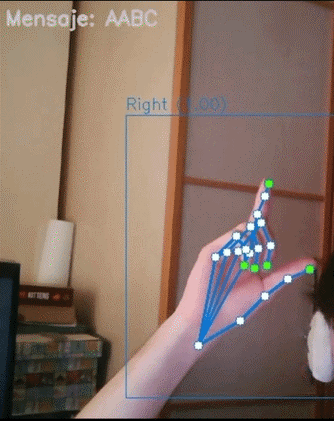
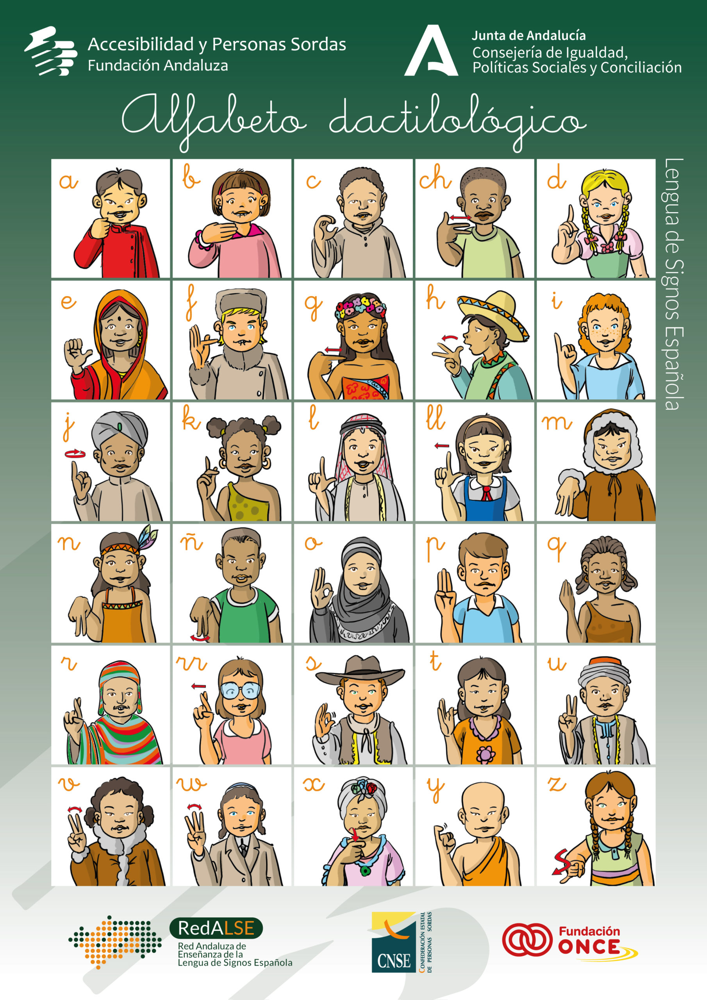
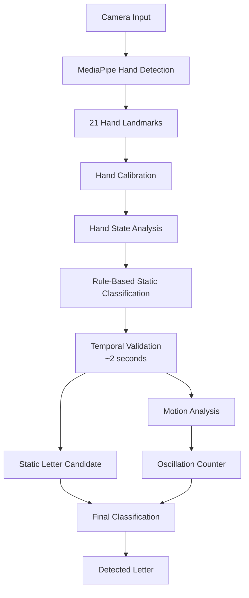

# Spanish Sign Language Alphabet Recognition

This repository contains the gesture recognition logic developed for a university project focused on real-time recognition of the Spanish Sign Language (LSE) fingerspelling alphabet.

The system is built on top of MediaPipe hand landmarks and implements a rule-based classifier developed from scratch using geometric analysis instead of a pre-trained gesture recognition model.

Instead of relying on a pre-trained gesture classification model, the recognition logic was implemented from scratch using geometric analysis of MediaPipe hand landmarks. 

## Overview

The original project was developed using a framework provided during the course, responsible for:

- Camera input
- User interface
- Hand landmark extraction using MediaPipe

This repository focuses on my contribution to the project: the implementation of the gesture recognition logic and letter classification algorithms.

## Demonstration

  

  <em>Real-time recognition of static and dynamic Spanish Sign Language letters.</em>

### Spanish Sign Language Alphabet

  

## Recognition Pipeline

The recognition system follows a multi-stage pipeline that combines hand landmark analysis, rule-based classification, temporal validation and motion analysis to identify both static and dynamic letters of the Spanish Sign Language alphabet.

The recognition algorithm is based on a rule-based approach built on top of the hand landmarks extracted by MediaPipe. Instead of using a trained machine learning model, each detected gesture is analysed through geometric rules and motion tracking.

The recognition pipeline consists of the following stages.

### 1. Hand Calibration

Before gesture recognition begins, the system performs a short calibration process (three seconds).

During this stage, several reference distances are measured to normalize the recognition process to the user's hand. These measurements are later used by the recognition logic to improve detection accuracy.

The original framework also provided a recalibration widget, allowing the user to repeat the calibration process whenever necessary.

### 2. Hand State Analysis

For every captured frame, MediaPipe extracts the 21 hand landmarks.

These landmarks are analysed to obtain a higher-level description of the hand, including:

- Hand orientation.
- Finger positions.
- Thumb configuration.
- Additional geometric properties required by the classifier.

Since the appearance of a finger changes depending on the hand orientation, different geometric rules are applied to determine whether each finger is extended, bent or semi-bent.

This information represents the current hand state and serves as the input for the recognition algorithm.

### 3. Static Gesture Recognition

Using the extracted hand state, the algorithm determines the most likely letter through a handcrafted rule-based classifier.

Rather than relying on a trained neural network, each letter is identified by evaluating geometric relationships between the detected landmarks.

To reduce false positives, a detected letter is only considered valid if it remains stable for two seconds.

### 4. Motion Analysis

While the static gesture is being validated, the system simultaneously analyses hand movement.

When a new gesture begins, a reference point is stored.

For every subsequent frame, the horizontal displacement of the hand relative to this reference point is measured.

Rather than measuring velocity or total displacement, the algorithm tracks the horizontal displacement relative to the initial reference point and counts the number of times the hand crosses it. This oscillation-based approach provides a simple and robust way to identify dynamic gestures while reducing sensitivity to movement speed.

If the number of oscillations exceeds a predefined threshold during the validation period, the gesture is classified as dynamic.

### 5. Final Classification

The final prediction combines both sources of information:

- The recognised static letter.
- Whether the gesture was static or dynamic.

This allows the system to distinguish between letters that share the same hand configuration but differ only by movement.

## Features

- Rule-based recognition using geometric analysis.
- Recognition of both static and dynamic letters.
- Motion-based gesture detection through oscillation analysis.
- Real-time recognition using MediaPipe hand landmarks.
- Live visualization of detected letters.

## Technologies

- Python 3
- MediaPipe hands_mp
- OpenCV
- NumPy

## Limitations

The original university framework is not included in this repository, therefore only the recognition logic is provided.

The recognition accuracy is limited by the precision of MediaPipe's landmark detection. Small inaccuracies may occasionally cause unstable predictions, especially for gestures requiring movement.

Some hand poses are also difficult to detect consistently due to self-occlusions and the inherent limitations of monocular hand tracking.

## Future Improvements

- Develop a standalone version independent of the original framework.
- Introduce a frame filtering mechanism to ignore isolated misclassifications instead of immediately resetting the validation timer.
- Make geometric thresholds proportional to the detected hand size, improving robustness against changes in the distance between the hand and the camera.
- Explore machine learning approaches and compare their performance with the current rule-based implementation.

## Code Structure

The project is organized around several core functions, each responsible for a specific stage of the recognition pipeline. The following diagram summarizes the relationship between the main functions.

| Function | Responsibility |
|----------|----------------|
| `prepare(sdl)` | Initializes the module and creates all required variables before the recognition process starts. |
| `process(frame, sdl)` | Main processing loop executed for every camera frame. |
| `analizarEstado(sdl, manos)` | Core recognition function. Analyses the detected hand and determines the current letter candidate from its geometric configuration. |
| `contadorMovimiento(sdl, manos, estado)` | Detects dynamic gestures by counting horizontal oscillations around a fixed reference point captured in the first frame of the gesture. |
| `letraActualMovida(letra)` | Combines the detected static letter with the motion analysis to determine the final dynamic letter. |
| `calibrarManos(manos, sdl)` | Performs the initial hand calibration by measuring reference distances used throughout the recognition process. |
| `recalibrar(sdl)` | Allows the calibration process to be restarted when necessary. |

### Hand State Analysis

The following helper functions are used internally by `analizarEstado()` to determine the geometric state of the hand.

| Function | Responsibility |
|----------|----------------|
| `doblado(...)` | Determines the bending state of each finger. |
| `pulgarFuera(...)` | Detects whether the thumb is outside the palm. |
| `estaGiradaHorizontalmente(...)` | Detects whether the hand is horizontally rotated. |
| `estaGiradaVerticalmente(...)` | Detects whether the hand is vertically rotated. |
| `estaDeLado(...)` | Determines whether the hand is viewed from the side. |
| `estaTumbada(...)` | Detects whether the hand is lying horizontally. |
| `dedosPegados(...)` | Determines whether selected fingers are touching each other. |
| `indiceCorazonCruzados(...)` | Detects crossed index and middle fingers. |
| `indicePulgarCruzados(...)` | Detects crossed index finger and thumb. |

### Utility Functions

| Function | Responsibility |
|----------|----------------|
| `scoreAltoAlMenosUnaMano(manos)` | Checks whether at least one detected hand has a confidence score above the required threshold. |

## Personal Reflection

This project reflects my approach to learning and problem solving.

Rather than relying on an existing gesture recognition model, I chose to design the recognition logic from first principles, building the classifier through geometric reasoning and iterative experimentation.

I believe modern AI tools are extremely valuable for improving productivity, debugging, and exploring ideas. However, when the goal is to truly understand a problem, I prefer to develop the core logic myself. For me, designing the solution is the most valuable part of the learning process.

This philosophy strongly influenced the design of this project. Understanding how and why the algorithm works was always a higher priority than simply obtaining the final result.

